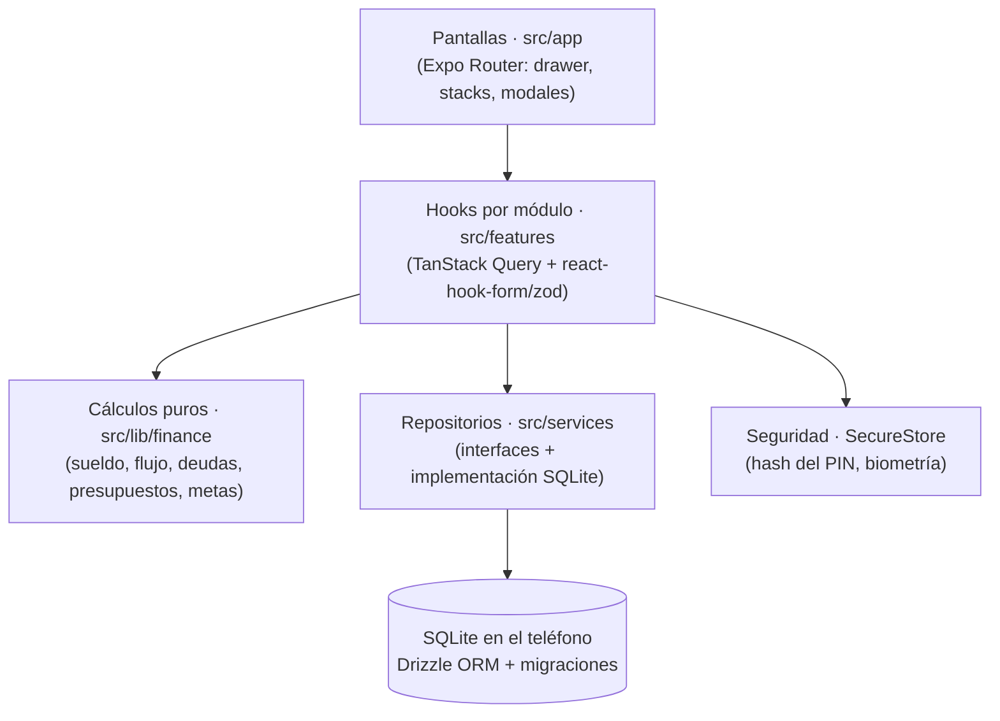

<div align="center">


# CoolWallet · Control de Gastos

**Tu flujo de dinero, claro y en tu bolsillo: lo que entra, lo que sale, lo que debes y lo que te queda.**

App móvil de finanzas personales pensada para Chile — interfaz en español, montos en pesos (CLP) y sueldo líquido calculado con las reglas chilenas.


[Funciones](#-funciones) · [Probarla](#-probarla-en-tu-celular-con-expo-go) · [Privacidad](#-tus-datos-y-tu-privacidad) · [Arquitectura](#-arquitectura) · [Desarrollo](#-desarrollo) · [Uso de IA](#-declaración-y-uso-de-ia)

</div>

---

## ✨ Por qué CoolWallet

- **🔒 Local-first, sin internet.** Sin servidores, sin cuentas, sin rastreo. Todo vive en una base SQLite dentro de tu teléfono.
- **🇨🇱 Hecha para Chile.** Calcula tu sueldo líquido (AFP, salud, cesantía, impuesto único, honorarios) con UF y UTM editables.
- **⚡ Registro en dos toques.** Montos frecuentes + categoría: anotar un café no debería costar más que el café.
- **🧠 Te dice cuánto puedes gastar hoy.** Gasto diario seguro y proyección al cierre del mes, descontando los gastos fijos que aún faltan por pagar.
- **🛡️ Protegida.** PIN de 4–6 dígitos con bloqueo progresivo, huella / Face ID y bloqueo automático al salir de la app.
- **♿ Accesible.** Contraste AA verificado automáticamente en modo claro y oscuro; los gráficos nunca dependen solo del color.

## 📱 Funciones

| Módulo | Qué puedes hacer |
|---|---|
| 🏠 **Inicio** | Resumen del mes: sueldo líquido, gastado, disponible y deuda total. Acceso a perfil, configuración, seguridad y respaldos. |
| 💳 **Billetera** | Cuentas con saldo (corriente, efectivo, tarjeta de crédito, ahorro), registro del sueldo en un toque, ingresos extra, ajustes de saldo, % gastado, gasto diario promedio y seguro, proyección al cierre, flujo del mes e historial con filtros. |
| 🛍️ **Gastos** | **Fijos** que generan su vencimiento cada período (solo los marcas como pagados, o los pausas) y **variables** con registro rápido. Top 3, costo anual, dona por categoría y comparación con el mes anterior. Categorías con ícono, color y grupo 50/30/20. |
| 📄 **Deudas** | Pendientes, en cuotas y variables. Abonos (cuota o extra) que descuentan de tu billetera, cuotas restantes, término estimado, interés pagado y por pagar, estado (al día / por vencer / vencida) y semáforo deuda/ingreso. |
| 🧮 **Simulador** | Compara las estrategias **bola de nieve** y **avalancha**: cuándo terminas de pagar y cuánto interés ahorras. |
| 🥧 **Presupuestos** | Un límite mensual por categoría con alertas al 80% y 100%, y sugerencia automática según la regla **50/30/20** basada en tu gasto real. |
| 🎯 **Metas de ahorro** | Cuánto ahorrar al mes para llegar a cada meta a tiempo, aportes y avance. |
| 📅 **Calendario** | Vencimientos del mes y recordatorios locales 1–2 días antes. |
| 📊 **Reportes** | Últimos 6 meses: ingresos vs gastos, tasa de ahorro, evolución de la deuda, observaciones automáticas y exportación a **CSV** (compatible con Excel). |

**Además:** onboarding guiado (nombre → sueldo → PIN → biometría), mes financiero por calendario o desde el día de pago, tema claro / oscuro / del sistema, foto de perfil y respaldo JSON versionado.

## 🚀 Probarla en tu celular con Expo Go

### 1. Requisitos

| Dónde | Qué necesitas |
|---|---|
| Computador | [Node.js](https://nodejs.org/) 20 LTS o superior (probada con Node 24) y Git |
| Teléfono | **Expo Go** actualizada ([Android](https://play.google.com/store/apps/details?id=host.exp.exponent) · [iPhone](https://apps.apple.com/app/expo-go/id982107779)), compatible con **Expo SDK 57** |
| Red | Computador y teléfono en la **misma Wi‑Fi** (o usa el modo túnel) |

### 2. Instalar e iniciar

```bash
git clone https://github.com/Pauaua/CoolWallet.git
cd CoolWallet
npm install
npx expo start
```

Escanea el **código QR** que aparece en la terminal:

- **Android:** abre Expo Go → **Scan QR code**.
- **iPhone:** apunta con la app **Cámara** y toca el aviso para abrir en Expo Go.

La primera carga tarda un poco mientras se arma el paquete. Luego verás la bienvenida: ingresa tu nombre, tu sueldo, crea tu PIN y listo.

> [!TIP]
> **¿No conecta?** En redes de oficina o con VPN usa `npx expo start --tunnel` (la primera vez puede pedir instalar `@expo/ngrok`). El túnel solo sirve para cargar la app durante el desarrollo: **la app en sí no usa internet**.

### 3. Qué funciona en Expo Go

| Función | Android (Expo Go) | iPhone (Expo Go) | Build propio |
|---|:---:|:---:|:---:|
| Todo el manejo de datos, gráficos, respaldos y CSV | ✅ | ✅ | ✅ |
| Desbloqueo con huella | ✅ | — | ✅ |
| Face ID | — | ❌ (usa el PIN) | ✅ |
| Notificaciones locales | ❌ (Expo Go las quitó en SDK 53) | ✅ | ✅ |

Cuando una función no está disponible, la app lo indica y todo lo demás sigue funcionando.

### 4. Problemas comunes

| Síntoma | Solución |
|---|---|
| Expo Go dice que el proyecto es de otra versión del SDK | Actualiza Expo Go desde la tienda. |
| Cambios que no aparecen o errores raros al cargar | `npx expo start -c` (limpia la caché). |
| “Network response timed out” | Misma Wi‑Fi, o `--tunnel`. |
| No puedo activar los recordatorios en Android | Necesitas un build propio (ver abajo). |

### 5. Build de desarrollo en Android (opcional)

Solo hace falta para lo que Expo Go no permite en Android, como las **notificaciones**.

1. **Android Studio → SDK Manager:** instala *Android SDK Platform 36* y *Build-Tools*.
2. **JDK 17:** `winget install EclipseAdoptium.Temurin.17.JDK`. No cambies `JAVA_HOME`: el script del proyecto usa el JDK 17 solo mientras compila.
3. En el teléfono activa **Opciones de desarrollador → Depuración USB**, conéctalo y comprueba con `adb devices`.
4. Compila e instala: `npm run android:build` (la primera vez tarda 10–20 minutos).
5. Día a día: `npx expo start` y abre la app **Control de Gastos** instalada. Solo recompila cuando se agregue una librería nativa.

> [!NOTE]
> La app instalada y Expo Go guardan datos por separado. Usa un respaldo para pasarlos de una a otra.

## 🔐 Tus datos y tu privacidad

- **Nada sale del teléfono** salvo los archivos que tú exportes. La app no hace llamadas de red.
- **PIN:** se guarda solo `SHA-256(sal:PIN)` con una sal aleatoria de 16 bytes, en el almacenamiento seguro del sistema (Keychain / Keystore). Tras 5 intentos fallidos se bloquea 30 s, duplicando la espera hasta un máximo de 15 min.
- **Respaldo:** *Inicio → Respaldo y datos → Exportar respaldo* crea un `.json` que puedes guardar en Drive, correo o Archivos. La app puede recordártelo cada 7, 14 o 30 días. El PIN **nunca** va en el respaldo.
- **¿Olvidaste el PIN?** *Olvidé mi PIN → Restaurar un respaldo* (y creas un PIN nuevo) o borrar todo y empezar de cero.

> [!WARNING]
> Si desinstalas la app o borras sus datos **sin un respaldo**, la información se pierde: no existe copia en ningún servidor.

## 🇨🇱 Valores legales aproximados

El sueldo líquido usa UF, UTM, topes imponibles, tramos del impuesto único, tasas de AFP, salud, seguro de cesantía y retención de honorarios **aproximados**, con fecha de referencia **septiembre de 2026** (`src/lib/finance/params.ts`). Cada pantalla que los usa muestra un aviso. Verifica los valores vigentes (SII, Superintendencia de Pensiones) y actualiza la UF y la UTM en *Configuración → Indicadores*.

## 🏗️ Arquitectura



**Principios de diseño**

- **Las pantallas no calculan ni tocan la base de datos.** Leen datos con hooks de `features/*/queries.ts`, que usan los repositorios. Esto deja la puerta abierta a sincronizar con la nube en el futuro sin reescribir la UI.
- **Toda la matemática financiera es pura y probada** en `src/lib/finance/` (con JSDoc). Cobertura actual: **100% de líneas y funciones**, ~96% de ramas.
- **Dinero como enteros en pesos**, redondeado una sola vez al final de cada cálculo. Los límites de gasto se redondean hacia abajo y los montos necesarios hacia arriba, para no sugerir nunca gastar de más ni ahorrar de menos.
- **Operaciones atómicas:** marcar un gasto fijo como pagado o registrar un abono crea el movimiento en la misma transacción de base de datos.
- **Datos auditables:** IDs UUID, `created_at` / `updated_at` y borrado lógico (`deleted_at`) en todas las tablas.
- **Mismas migraciones en la app y en las pruebas:** los repositorios se prueban con `better-sqlite3` en memoria usando las migraciones reales.
- **Respaldo versionado:** `{ app, schemaVersion, exportedAt, data }`, validado con esquemas zod generados desde Drizzle y con migraciones entre versiones del formato.

<details>
<summary><strong>Modelo de datos (11 tablas)</strong></summary>

| Tabla | Contenido |
|---|---|
| `profile` | Nombre, sueldo bruto, día de pago, contrato, AFP, salud y foto (fila única) |
| `settings` | Tema, mes financiero, bloqueo, UF/UTM, recordatorios (fila única) |
| `accounts` | Cuentas y su saldo inicial |
| `categories` | Categorías de gasto fijo/variable, ícono, color y grupo 50/30/20 |
| `transactions` | Movimientos: `income`, `fixed_expense`, `variable_expense`, `debt_payment`, `adjustment` |
| `fixed_expenses` | Definición de cada gasto fijo |
| `fixed_expense_occurrences` | Vencimiento de cada gasto fijo por período |
| `debts` | Deudas pendientes, en cuotas o variables |
| `debt_payments` | Abonos, ligados a su movimiento |
| `budgets` | Un presupuesto por categoría |
| `savings_goals` | Metas de ahorro y su avance |

</details>

<details>
<summary><strong>Estructura del proyecto</strong></summary>

```
src/
  app/              Pantallas y navegación (Expo Router)
    (onboarding)/     bienvenida → nombre → sueldo → PIN → biometría
    (app)/            drawer con los 8 módulos y pantallas secundarias
    (modals)/         formularios: gasto rápido, abono, meta, presupuesto…
    lock.tsx          pantalla de bloqueo
  components/       UI reutilizable (AppText, AmountField, PinPad, StateViews…)
  features/         lógica por módulo: consultas, formularios y componentes
  lib/finance/      cálculos financieros puros, con pruebas
  db/               esquema Drizzle, migraciones y datos iniciales
  services/         repositorios, seguridad, archivos, respaldo y notificaciones
  store/            estado de UI (Zustand): sesión y tema
  theme/            tokens de color, tipografía y espaciado (claro y oscuro)
  types/            enums y modelos de entidades
scripts/
  generate-icons.js   genera ícono, ícono adaptativo, splash y favicon
  run-android.ps1     build de Android con JDK 17 aislado
```

</details>

## 🛠️ Desarrollo

### Stack

| Área | Tecnología |
|---|---|
| Plataforma | Expo SDK 57 · React Native 0.86 · React 19 (React Compiler) · TypeScript 6 estricto |
| Navegación | Expo Router con rutas tipadas (drawer + stacks + modales) |
| Datos | `expo-sqlite` + Drizzle ORM (migraciones con `drizzle-kit`) · TanStack Query v5 · Zustand |
| Formularios | react-hook-form + zod v4 |
| Seguridad | `expo-secure-store` · `expo-local-authentication` · `expo-crypto` |
| UI | Inter · íconos Feather · react-native-gifted-charts · selector de fecha nativo |
| Archivos | `expo-sharing` · `expo-document-picker` · `expo-file-system` · `expo-image-picker` |
| Pruebas | Jest (`jest-expo`) · Testing Library para React Native · `better-sqlite3` |

### Comandos

```bash
npm start               # servidor de desarrollo (Expo)
npm run typecheck       # TypeScript (tsc --noEmit)
npm run lint            # ESLint
npm test                # pruebas (Jest)
npm run test:coverage   # cobertura (umbral exigido en src/lib/finance)
npm run check           # typecheck + lint + test: correr antes de cada commit
npm run db:generate     # genera una migración tras cambiar src/db/schema.ts
npm run android:build   # build de desarrollo en Android
node scripts/generate-icons.js   # regenera ícono y splash
```

> [!IMPORTANT]
> Instala dependencias siempre con `npx expo install <paquete>` para que las versiones calcen con el SDK.

### Calidad

- **433 pruebas en 37 suites**: cálculos financieros, repositorios sobre SQLite real, migraciones, ciclo completo de respaldo, seguridad del PIN, filtros, reportes y navegación.
- **Umbral de cobertura** en `src/lib/finance/`: 98% líneas, 100% funciones, 95% ramas.
- **Contraste automatizado** (`src/theme/__tests__/contrast-test.ts`): AA 4,5:1 en todo par de texto/fondo y 3:1 en elementos gráficos, en ambos modos.
- **Lint estricto:** sin `any` y sin colores literales fuera de `src/theme/`.

### Convenciones

- Código en inglés, textos de interfaz en español de Chile; las rutas van en español (`/billetera`).
- Colores solo desde `src/theme/`; tipografía con `<AppText variant=…>`.
- Cada pantalla con datos tiene estados de carga, vacío y error. Nunca datos falsos.
- Botones solo-ícono con `accessibilityLabel` y área táctil mínima de 44 pt.
- Al cambiar el esquema: generar la migración, subir `BACKUP_SCHEMA_VERSION` y agregar su paso de migración del respaldo.

## 🤖 Declaración y uso de IA

CoolWallet es un proyecto de autoría propia. La idea, el enfoque del producto y el código principal son míos: definí qué problema resolver, cómo debía funcionar el modelo de dinero (sueldo, cuentas, gastos fijos y variables, deudas) y escribí la base de la aplicación.

Durante el desarrollo usé un asistente de programación con IA (Claude, de Anthropic, a través de Claude Code) como **herramienta de apoyo**, de forma complementaria a mi trabajo. Lo utilicé principalmente para:

- **Acelerar el desarrollo:** tareas repetitivas, código de apoyo y ajustes en varios archivos a la vez.
- **Pruebas:** escribir y ampliar la batería de tests (cálculos financieros, repositorios, migraciones, respaldo) y revisar casos borde.
- **Revisión y depuración:** detectar errores, diagnosticar problemas de compatibilidad (por ejemplo, Expo Go en Android) y proponer correcciones.
- **Calidad y accesibilidad:** auditoría de contraste de colores, revisión de accesibilidad y consistencia con las convenciones del proyecto.
- **Documentación:** redacción y ordenamiento de este README y de las guías internas.

Todas las decisiones de diseño y de producto fueron mías, y revisé, ajusté y validé cada aporte del asistente antes de incorporarlo. La responsabilidad sobre el código y su funcionamiento es mía.

## 📄 Licencia

Distribuida bajo licencia MIT. Ver [`LICENSE`](./LICENSE).
